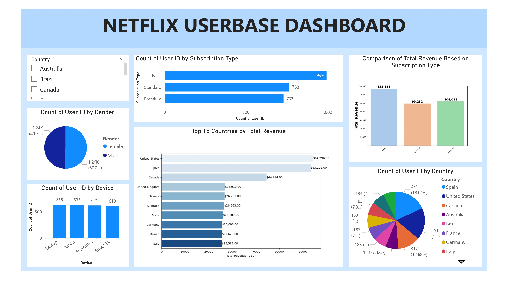

# 📊 Netflix Userbase Analysis Dashboard  

This repository contains an interactive dashboard that provides insights into Netflix's userbase. The analysis focuses on user distribution by **subscription type, gender, device, and country**, along with **total revenue comparisons**.  

## 📌 Project Overview  
This project aims to analyze Netflix's userbase data to extract meaningful insights using **Jupyter Notebook, Python, and Power BI**. The dashboard visualizes key metrics such as:  
- **User distribution by subscription type**  
- **Revenue comparison across different subscription plans**  
- **User demographics (gender, device usage, and country-wise distribution)**  

## 📷 Dashboard Preview  
  

## 📂 Repository Contents  
- `netflix-userbase-analysis.ipynb` → Jupyter Notebook for data analysis  
- `Netflixx_page-0001.jpg` → Screenshot of the dashboard  
- `README.md` → Documentation  

## 🛠 Tools Used  
- **Python (Pandas, Matplotlib, Seaborn)** → Data cleaning and visualization  
- **Power BI** → Dashboard creation  

## 📈 Insights from Analysis  
1️⃣ **Most users are subscribed to the Basic plan**, followed by Standard and Premium.  
2️⃣ **United States and Spain generate the highest total revenue** among all countries.  
3️⃣ **Laptop is the most common device** for accessing Netflix.  
4️⃣ **Gender distribution is almost equal**, with a slight majority of male users.  

## 🚀 How to Use  
1️⃣ Clone the repository:  
   ```sh
   git clone https://github.com/Roberttwil/Netflix-Userbase.git
